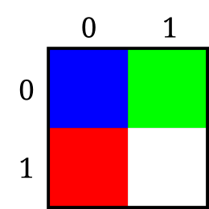
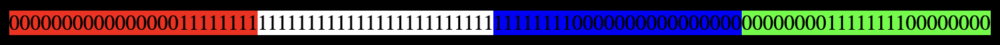
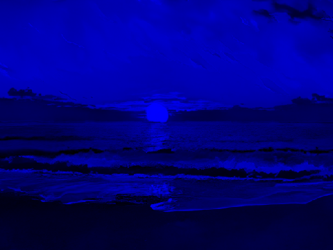
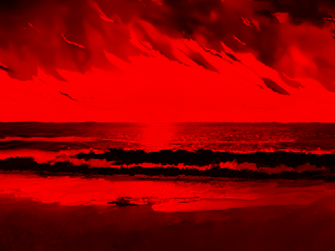
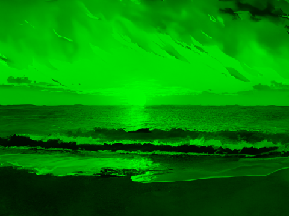
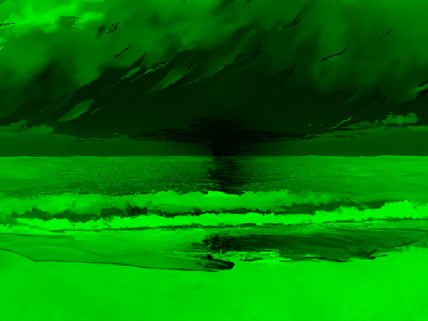

# bitmap

### Learning Objectives

- Bits and bytes
- I/O
- Algorithms
- Files

### Abstract

In this project, you will create a tool called `bitmap` to:

- Read and write bitmap image files.
- Apply basic image processing algorithms.
- Manipulate and transform bitmap images.

### Context

Have you ever wondered how pictures are stored as files?

Imagine a grid of tiny squares, like a paper in math notebook. Each square (pixel) can be colored in one of the available colors. The more squares there are in the grid, the more detailed the image will be. A file that stores such a grid of pixels is called a bitmap.

In fact, Bitmap stores not just a grid but also meta information about the file. Bitmap file can be divided into 2 main parts.

1. Header
2. Data

**Header**:
Header stores meta information about the file, such as what type of file it is, the file size, the height and width of the image, how many bits are allocated for the color of the pixel, and so

**Data**:
Contains the grid with colors.

When reading the grid of colors, it is important to know how many bits can be allocated per pixel. It contained in the bitmap file header. For each pixel can be allocated 1 bit, 4 bits, 8 bits, 16 bits, 24 bits and 32 bits, where 1 bit is black and white and 24 bits is multi-color. Basically, most bitmap files allocate 24-bit per color.

Why 24 bit?

Any color can be obtained from three primary colors, these are red, green and blue (this is called RGB), where 8 bits are allocated for each primary color. That is, 8 bits for red, 8 bits for green and 8 bits for blue. If you represent the color in bits, it will look like this:

- `000000001000110101100100` (24 bits) -> `00000000 10001101 01100100` (24 bits / 3) -> `0 141 100` (in decimal) -> `0x00 0x8D 0x64` (in hexadecimal) -> `#008D64` -> dark green.

But when reading a cell allocated to one pixel, you will notice that it stores colors the other way around, not RGB but BRG. It means, color green will be stored as `01100100(blue) 10001101(green) 00000000(red)` instead of `00000000(red) 10001101(green) 01100100(blue)`.

Example of a 2 by 2 grid, where 24 bits per color are allocated per pixel:



In bits:



Usually pixels are stored "bottom-up", starting in the lower left corner, going from left to right, and then row by row from the bottom to the top of the image. But it is also worth considering that the pixels can be stored "upside-down" from left top corner.

### Resources

- Read about `bitmap file` [here](https://en.wikipedia.org/wiki/BMP_file_format) or [here](https://www.ece.ualberta.ca/~elliott/ee552/studentAppNotes/2003_w/misc/bmp_file_format/bmp_file_format.htm)
- Read about `magic bytes` in file [here](https://gist.github.com/leommoore/f9e57ba2aa4bf197ebc5)
- Read about [RGB color formats](https://en.wikipedia.org/wiki/List_of_monochrome_and_RGB_color_formats)

### General Instructions

- Your code MUST be written in accordance with [gofumpt](https://github.com/mvdan/gofumpt). If not, you will be graded `0` automatically.
- Your program MUST be able to compile successfully.
- Your program MUST not exit unexpectedly (any panics: `nil-pointer dereference`, `index out of range` etc.). If so, you will be get `0` during the defence.
- Only [standard packages](https://pkg.go.dev/std) are allowed. If not, you will get `0` grade.
- The project MUST be compiled by the following command in the project's root directory:

```sh
$ go build -o bitmap .
```

- If an error occurs, the program must exit with non zero status code and display a clear and understandable error.

### Mandatory Part

#### Header

The `Header` feature reads a bitmap image file and outputs its properties.

Requirements:

- The program must be able to print header by sub command `header`.
- The output header information of a bmp file must contain at least information about:
  - `file type`
  - `file size in bytes`
  - `header size`
  - `DIB header size`
  - `width in pixels`
  - `height in pixels`
  - `pixel size in bits`
  - `image size in bytes`
- We do not limit the number of headings, you can display more headings at your discretion.
- If any error print an error message with non zero exit status.

Example:


```sh
$ xxd sample.bmp
00000000: 424d 38e9 0700 0000 0000 3600 0000 2800  BM8.......6...(.
00000010: 0000 e001 0000 6801 0000 0100 1800 0000  ......h.........
00000020: 0000 02e9 0700 120b 0000 120b 0000 0000  ................
00000030: 0000 0000 0000 2418 2426 1926 2718 2725  ......$.$&.&'.'%
00000040: 1828 251a 2a29 1e2e 2a1e 2e2a 1f2f 291e  .(%.*)..*..*./).
00000050: 2e2b 1f2e 2b1e 2c28 1b2b 2a1e 2e2a 1f30  .+..+.,(.+*..*.0
00000060: 2f23 3636 2b3f 382d 3f38 2d3f 382e 3f3a  /#66+?8-?8-?8.?:
00000070: 3041 392d 3f36 2a3c 3428 392e 2333 3327  0A9-?6*<4(9.#33'
00000080: 3733 2636 2f23 332f 2534 3127 352f 2433  73&6/#3/%41'5/$3
00000090: 2e21 312f 2133 2f21 3231 2233 3325 3731  .!1/!3/!21"33%71
$
```

```sh
$ ./bitmap header sample.bmp
BMP Header:
- FileType BM
- FileSizeInBytes 518456
- HeaderSize 54
DIB Header:
- DibHeaderSize 40
- WidthInPixels 480
- HeightInPixels 360
- PixelSizeInBits 24
- ImageSizeInBytes 518402
$
```

Error example:

```sh
$ ./bitmap header salem.txt
Error: salem.txt is not bitmap file
$ echo $?
1
```

#### Mirror

The `mirror` feature mirrors a bitmap image either horizontally or vertically.

Requirements:

1. Mirror the image horizontally or vertically. The flag `--mirror` should handle options bellow:

- `horizontal`, `h`, `horizontally`, `hor`
- `vertical`, `v`, `vertically`, `ver`.

2. The `--mirror` option can be combined using multiple times.
3. If any error print an error message with non zero exit status.

> Mirroring a photo vertically is replacing pixels from `top` to `bottom`.

Example:

```sh
$ ls -A
sample.bmp
$ ./bitmap apply --mirror=horizontal sample.bmp sample-mirrored-horizontal.bmp
$ ls -A
result.bmp sample.bmp
$
```

Result:


#### Filter

The program should be able to apply various filters to images using the `--filter` flag.

Requirements:

1. The program must accept filters for images specified by the `--filter` flag. The `--filter` flag should accept a value indicating the type of filter to apply. Multiple filters can be specified by using the `--filter` flag multiple times.

- `--filter=blue`: Apply a filter that retains only the blue channel.
- `--filter=red`: Apply a filter that retains only the red channel.
- `--filter=green`: Apply a filter that retains only the green channel.
- `--filter=grayscale`: Convert the image to grayscale.
- `--filter=negative`: Apply a negative filter.
- `--filter=pixelate`: Apply a pixelation effect. Option pixelates the image with a block size of 20 pixels by default.
- `--filter=blur`: Apply a blur effect.

> You can use any algorithm to realize `grayscale`, `negative`, `pixelate`,`blur` filters.

2. Filters should be applied sequentially in the order they are provided.
3. The `--filter` option can be combined using multiple times.
4. If any error print an error message with non zero exit status.

Examples:

Filter blue:

```sh
$ ./bitmap apply --filter=blue sample.bmp sample-filtered-blue.bmp
```

Result:



Filter red:

```sh
$ ./bitmap apply --filter=red sample.bmp sample-filtered-red.bmp
```

Result:



Filter green:

```sh
$ ./bitmap apply --filter=green sample.bmp sample-filtered-green.bmp
```

Result:



Filter negative:

```sh
$ ./bitmap apply --filter=negative sample.bmp sample-filtered-negative.bmp
```

Result:


Filter pixelate:

```sh
$ ./bitmap apply --filter=pixelate sample.bmp sample-filtered-pixelate.bmp
```

Result:


Filter blur:

```sh
$ ./bitmap apply --filter=blur sample.bmp sample-filtered-blur.bmp
```

Result:


#### Rotate

The `rotate` feature rotates a bitmap image by a specified angle.

Requirements:

1. The program must be able to rotate the image to the any direction using the parameter `--rotate`. The flag `--rotate` should handle options `right` (clockwise), `90`, `180`, `270`, `left`, `-90`, `-180`, `-270`.
2. The `--rotate` option can be used multiple times to achieve the desired rotation. For example, using `--rotate=right` twice will rotate the image by 180 degrees.
3. If any error print an error message with non zero exit status.

Example:

Rotate image to right twice:

```sh
$ ./bitmap apply --rotate=right --rotate=right sample.bmp sample-rotated-right-right.bmp
```

Result:


#### Crop

The `crop` feature trims a bitmap image according to specified parameters.

Requirements:

1. The program crops a bitmap image using the `--crop` flag. The `--crop` option accepts either 2 or 4 values in pixels.
2. The `--crop` option can be combined using multiple times.
3. If any error print an error message with non zero exit status.

How the `--crop` option works:

- The `--crop` option accepts values that specify the offset by X, the offset by Y, the width, and the height. (`--crop=OffsetX-OffsetY-Width-Height`). Where width and height are optional. If the width and height are not provided, then how the values ​​for the width and height will be the remaining distance to the end of the photo.
- The `--crop` option can be used multiple times to achieve the desired size.
- If the total crop values ​​exceed the image size, the program should display an error.

> When the file size is changed, the headers must also be updated.

Examples:

```sh
$ ./bitmap header sample.bmp | grep "Pixels"
- WidthInPixels 480
- HeightInPixels 360
```

Example of cropping a photo:

```sh
$ ./bitmap apply --crop=20-20-100-100 sample.bmp sample-cropped-20-20-80-80.bmp
```

Result:


Example of cropping a photo without width and height:

```sh
$ ./bitmap apply --crop=400-300 sample.bmp sample-cropped-400-300.bmp
```

Result:


Example of cropping a photo with multiple options:

```sh
$ ./bitmap apply --crop=20-20-100-100 --crop=25-25-50-50 sample.bmp sample-cropped-45-45-50-50.bmp
```

Result:


#### Combine apply options

The program can combine all options of `apply` subcommand.

Requirements:

1. The program options must be processed sequentially. This means that if each option of subcommand `apply` were executed one after the other, the result would be the same.
2. If any error print an error message with non zero exit status.

```sh
$ ./bitmap apply --mirror=horizontal --rotate=right --filter=negative --rotate=left --filter=green sample.bmp sample-mh-rr-fn-rl-fg.bmp
```



#### Help

The `help` feature provides information about how to use the program.

Requirements:

1. The program should display a help message when the `-h` or `--help` flag is used.
2. The help feature has maximum priority, which means that when a program operates by combining options with a help flag, program must print help message.
3. The help message should include information about all available flags and their usage.

Example:

```sh
$ ./bitmap
Usage:
  bitmap <command> [arguments]

The commands are:
  header    prints bitmap file header information
  apply     applies processing to the image and saves it to the file
$ ./bitmap header --helps
Usage:
  bitmap header <source_file>

Description:
  Prints bitmap file header information
$ ./bitmap apply --help
Usage:
  bitmap apply [options] <source_file> <output_file>

The options are:
  -h, --help      prints program usage information
  ...
```

### Edge Cases

- The program should only accept `bitmap` files, if it is not a bitmap file, then the program must exit with non zero status code and display error message.
- The program should only accept valid `uncompressed` `24-bit color` `bitmap` files.
- The program takes file names as the last arguments.
- The program can overwrite an existing file.
- If you receive an invalid flag (option), show an error with non-zero exit code.

## Guidelines from Author

**How to start**

When you open this project, you may scare thinking how it large. But don't worry, if you decompose this project to mini tasks until it will be clear to you, you will see how it is possible. So firstly I recommend you decompose this project, and I will help you with decompose it on start, but after you will do it with self or teammates. I recommend do every feature (`header`, `filter`, ...) in order which I wrote, cause every next feature harder than previous, and doing previous feature, you will understand how to make next feature.

Okay, let's split project to steps, with starting from subcommand `header`.

Step 1: Program must read option `header` and `filename` given as argument. But okay, lets split it to mini tasks.

> 1.  How to read arguments given to the program?
> 2.  How to understand is program should work in header info mode.
> 3.  Okay, how to know, is arguments correct?

Step 2: Program must read the file header information. So abstract, let's decompose it.

> 1. How to read file, using golang? What should I use?
> 2. How to recognize file header?
>
> 2.1. How to recognize every field in file header.

Step 3: Program must print header information.

This is my example of decomposing, my advise is **do not forgot about decomposing problems, it will always help you**.

## Support

**Is it normal for a beginner to have some trouble on problems and exercises?**

ABSOLUTELY YES!

Failing and struggling is something every beginner goes through: you're supposed to struggle. So instead of feeling discouraged, you should embrace this: struggle is a sign that you're challenging yourself. Use it as a guide to help you figure out what material you need to review and learn next, or what questions you should be asking.

Source: https://www.reddit.com/r/learnprogramming/wiki/faq/#wiki_is_it_normal_for_a_beginner_to_have_some_trouble_on_problems_and_exercises.3F

## Author

This project has been created by:

Dias Kappassov, FrontEnd Developer at Doodocs.kz

Contacts:

- Email: [diaskappassov@gmail.com](mailto:diaskappassov+alem@gmail.com)
- [GitHub](https://github.com/Dias1c/)
- [LinkedIn](https://www.linkedin.com/in/diaskappassov/)
